# Guía de Usuario — App Mobile Bazaar

Bazaar es una plataforma de marketplace donde podés comprar y vender productos. La app está disponible para Android.

---

## Navegación principal

La barra inferior tiene cinco secciones:

- **Inicio** — home con productos destacados por categoría
- **Explorar** — búsqueda y filtrado de productos
- **Carrito** — productos seleccionados para comprar
- **Órdenes** — historial y seguimiento de compras
- **Ventas** — gestión de publicaciones como vendedor

El ícono de campana en la esquina superior derecha muestra las notificaciones. El círculo con tu inicial en la esquina superior izquierda accede a tu perfil.

---

## Inicio

Al abrir la app se muestra el home con productos organizados por categoría.

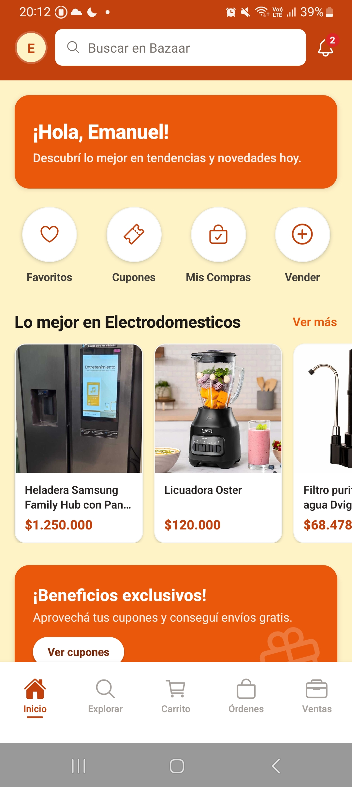

El home incluye:
- Saludo personalizado con tu nombre
- Accesos rápidos a **Favoritos**, **Cupones**, **Mis Compras** y **Vender**
- Secciones de productos por categoría (Electrodomésticos, Tecnología, Ropa, Hogar) con opción **Ver más**
- Banner de **Beneficios exclusivos** para acceder a cupones de descuento

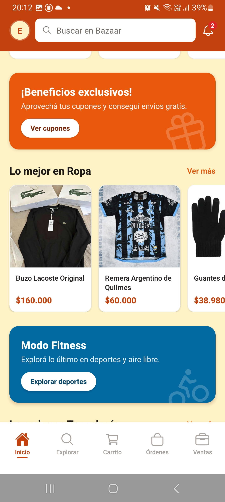

Scrolleando hacia abajo aparecen más categorías y la sección de **Recién publicados**.

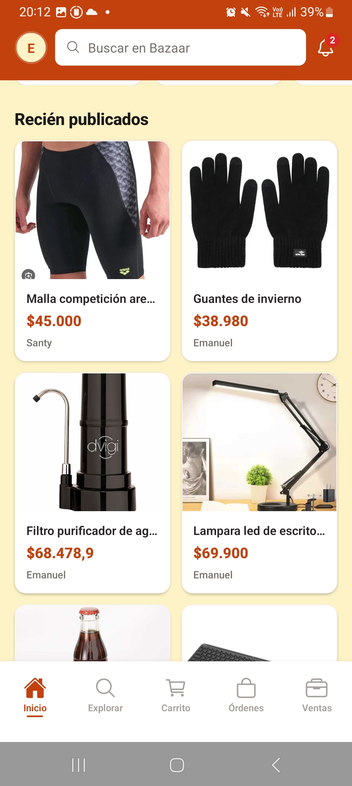

---

## Explorar productos

La sección Explorar permite buscar y filtrar productos de toda la plataforma.

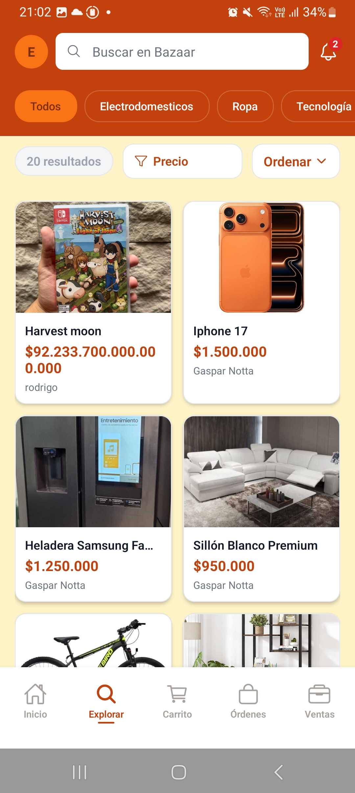

### Filtrar por categoría

Los chips horizontales en la parte superior permiten filtrar por categoría: **Todos**, **Electrodomésticos**, **Ropa**, **Tecnología**, **Hogar**, entre otras.

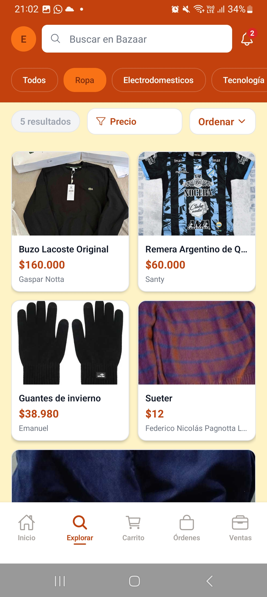

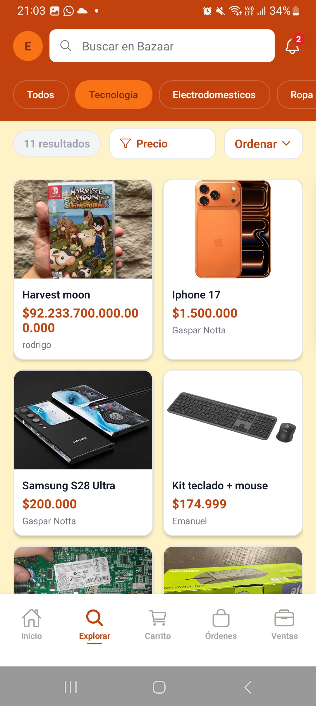

### Ordenar y Filtrar

Tocá **Ordenar** para cambiar el criterio de ordenamiento de los resultados. Tocá **Precio** para abrir el panel de rango de precios. Ingresá un precio mínimo y máximo y los resultados se filtran automáticamente.

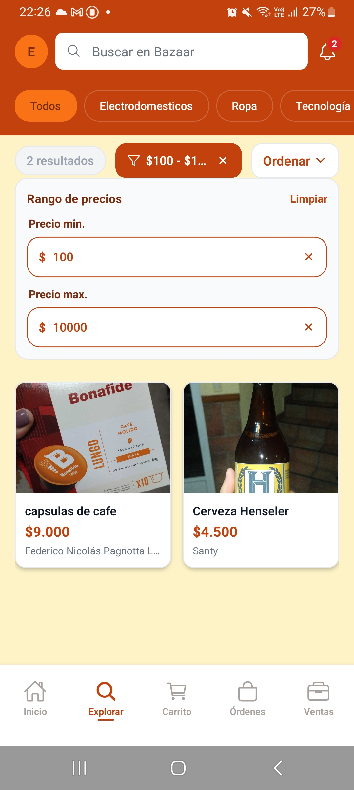

El filtro aplicado aparece como chip con opción de eliminarlo tocando la **X**.

---

## Detalle de producto

Al tocar un producto se accede a su detalle con foto, categoría, stock disponible, precio, vendedor y descripción.

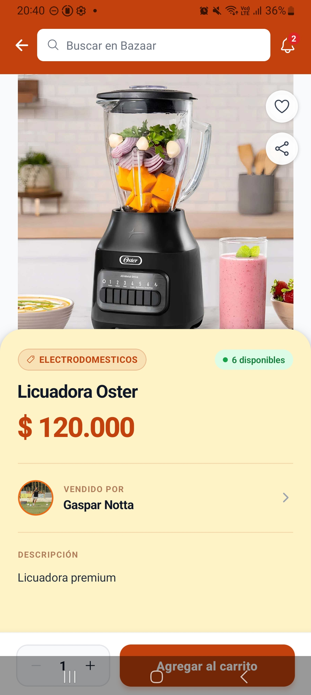

Desde esta pantalla podés:
- Tocar el **corazón** para agregar a tu wishlist
- Tocar el **ícono de compartir** para compartir el link del producto
- Ajustar la cantidad con los botones **−** y **+**
- Tocar **Agregar al carrito** para sumar el producto

---

## Carrito

El carrito muestra los productos seleccionados para comprar.

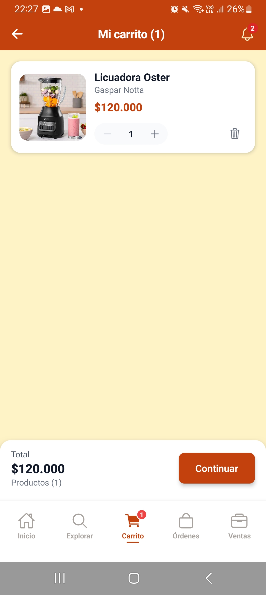

Cuando el carrito está vacío se muestra un mensaje con el botón **Explorar** para ir a buscar productos. El ícono del carrito en la barra inferior muestra un badge con la cantidad de productos cuando hay items.

Desde el carrito podés:
- Ajustar la cantidad de cada producto con los botones **−** y **+**
- Eliminar un producto tocando el ícono de tacho
- Ver el total y la cantidad de productos
- Tocar **Continuar** para iniciar el checkout

---

## Checkout

Al confirmar la compra desde el carrito se accede al flujo de checkout en dos pasos: **Dirección** y **Comprar**.

Primero ingresar la dirección de entrega.

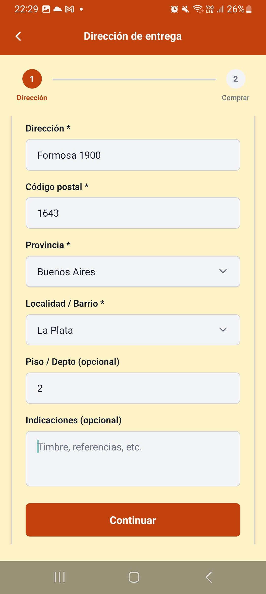

Completá:
- **Dirección** — calle y número
- **Código postal**
- **Provincia** — selector desplegable
- **Localidad / Barrio** — selector desplegable
- **Piso / Depto** — opcional
- **Indicaciones** — opcional (timbre, referencias, etc.)

Una vez completados los campos obligatorios el botón **Continuar** se habilita para pasar al paso 2.

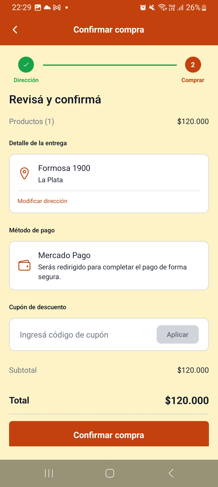

En la pantalla de confirmación podés:
- Ver el detalle de productos y el total
- Verificar o modificar la dirección de entrega
- Ver el método de pago (MercadoPago)
- Ingresar un **cupón de descuento** si tenés uno disponible
- Tocar **Confirmar compra** para ser redirigido a MercadoPago y completar el pago

## Mis compras / Órdenes

La sección Órdenes muestra el historial de compras filtrable por estado.

Los filtros disponibles son: **Todas**, **Pendientes**, **Confirmadas**, **En preparación**, **En camino**, **Entregadas** y **Canceladas**.

Cuando no hay órdenes en el estado seleccionado se muestra el mensaje "Sin órdenes".

---

## Wishlist

La wishlist muestra los productos que guardaste como favoritos.

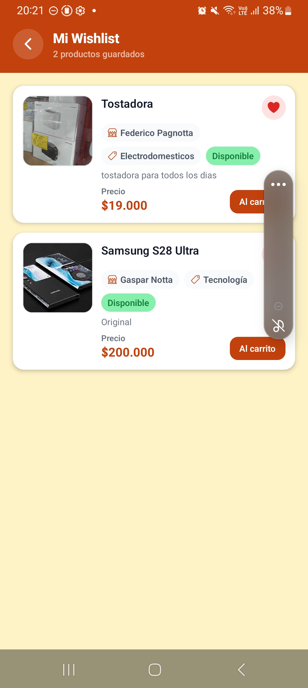

Desde la wishlist podés agregar cualquier producto directamente **Al carrito** o quitarlo tocando el corazón rojo.

---

## Publicar un producto

Para publicar un producto como vendedor, accedé a **Ventas** desde la barra inferior o tocá **Vender** en el home.

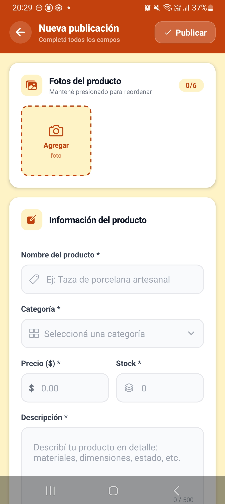

Completá el formulario con:
- **Fotos del producto** — hasta 6 fotos, mantené presionada para reordenar. La primera foto es la portada.
- **Nombre del producto**
- **Categoría**
- **Precio**
- **Stock**
- **Descripción**

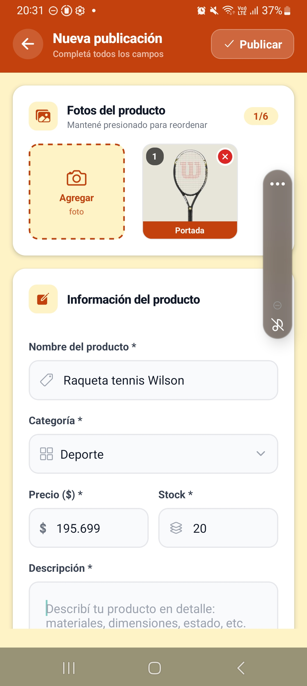

Una vez completados todos los campos tocá **Publicar producto** para publicar.

---

## Notificaciones

Tocá el ícono de campana en la esquina superior derecha para ver las notificaciones.

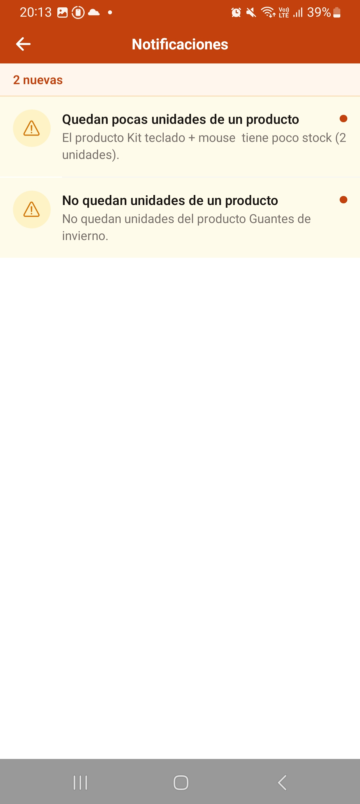

Las notificaciones incluyen alertas de stock bajo y sin stock para los productos que publicás como vendedor. Las notificaciones nuevas se marcan con un punto naranja.

---

## Perfil

Accedé a tu perfil tocando el círculo con tu inicial en la esquina superior izquierda de cualquier pantalla.

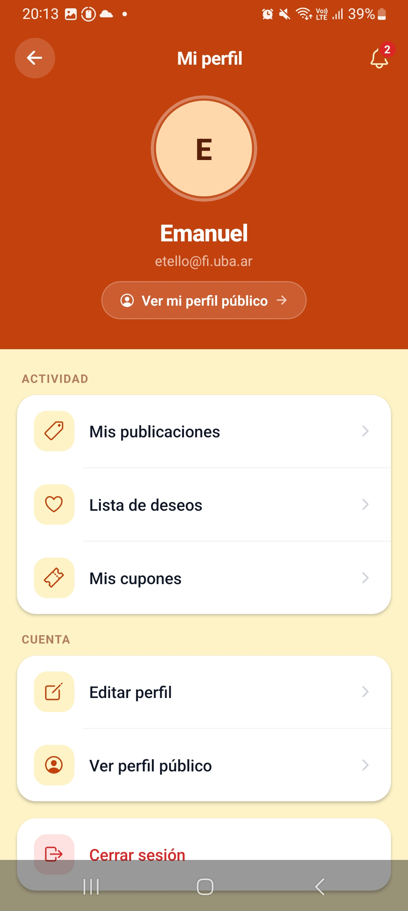

Desde el perfil podés:
- Ver tu nombre y email
- Acceder a **Mis publicaciones**
- Acceder a tu **Lista de deseos**
- Ver tus **Cupones**
- **Editar perfil** para actualizar tu información
- **Ver perfil público** para ver cómo te ven otros usuarios
- **Cerrar sesión**

---

## Mis cupones

Desde el perfil accedé a **Mis cupones** para ver y gestionar los cupones creados.

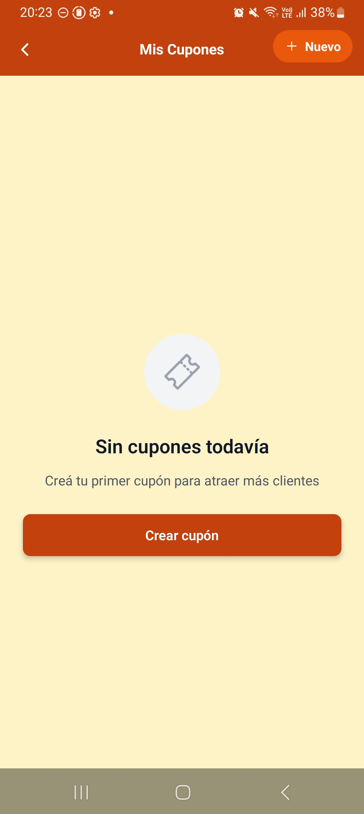

Tocá **+ Nuevo** o **Crear cupón** para crear un cupón nuevo.

---

## Cupones de descuento

Como vendedor podés crear cupones de descuento para tus compradores.

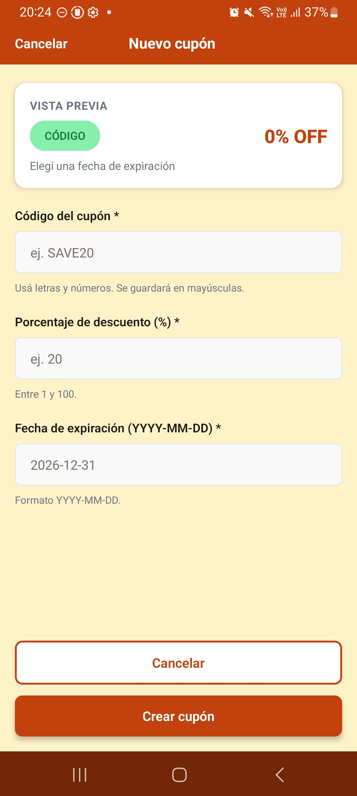

Completá:
- **Código del cupón** — letras y números, se guarda en mayúsculas (ej: SAVE20)
- **Porcentaje de descuento** — entre 1 y 100
- **Fecha de expiración** — en formato YYYY-MM-DD

Una vista previa del cupón se actualiza en tiempo real mientras completás el formulario. Tocá **Crear cupón** para guardarlo.