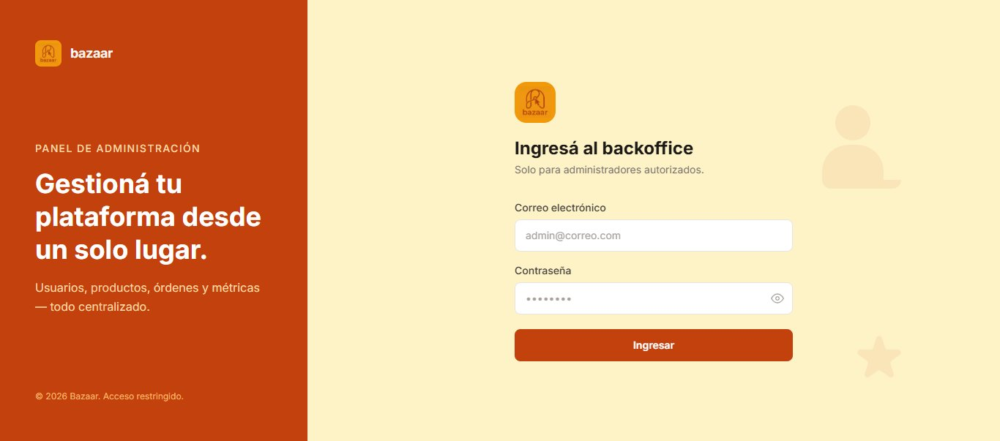
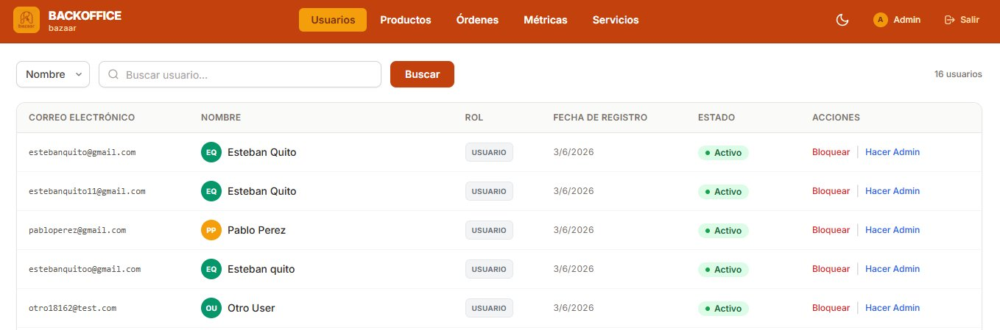
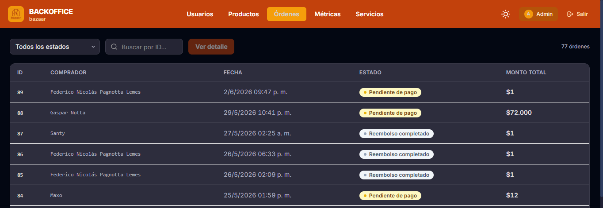
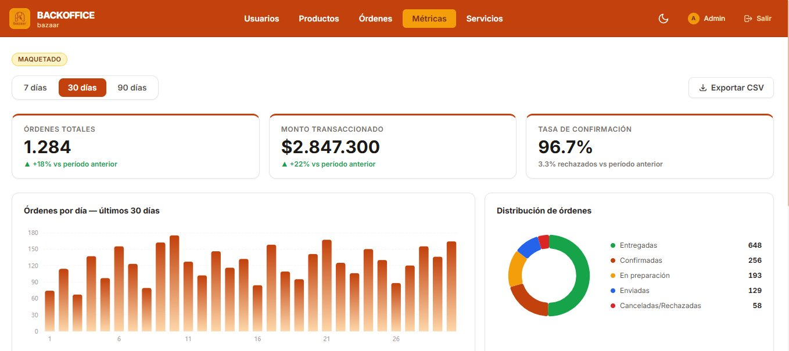
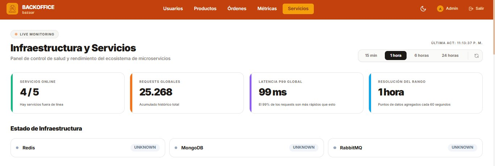
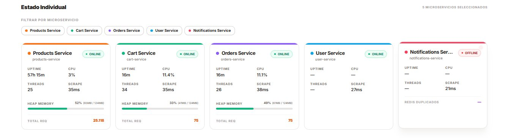
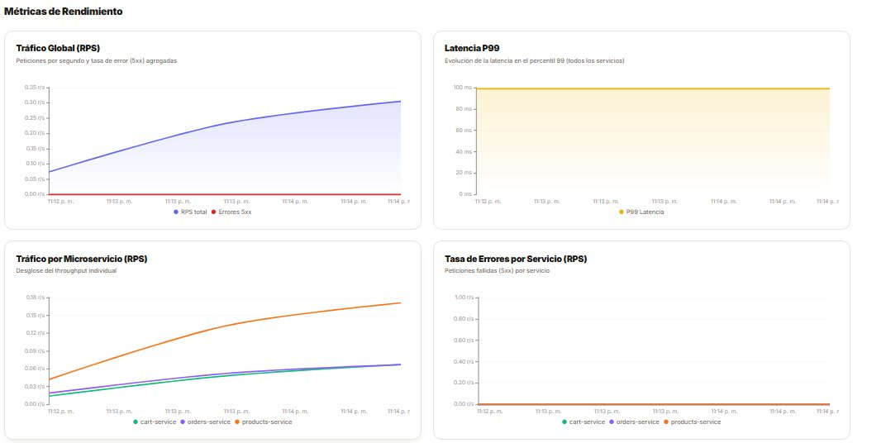
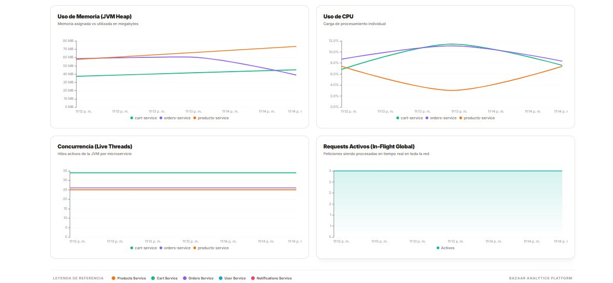

# Guía de Usuario — Backoffice Bazaar

El backoffice es el panel de administración de la plataforma Bazaar. Permite gestionar usuarios, productos, órdenes y visualizar métricas del sistema. El acceso está restringido a administradores autorizados.

---

## Acceso

Para ingresar al backoffice:

1. Ingresá tu **correo electrónico** de administrador
2. Ingresá tu **contraseña**
3. Hacé clic en **Ingresar**

> El backoffice es de acceso exclusivo para administradores. Intentar ingresar con una cuenta de usuario regular será rechazado.

---

## Navegación

La barra superior contiene las secciones principales:

- **Usuarios** — gestión de cuentas registradas en la plataforma
- **Productos** — listado y moderación de publicaciones
- **Órdenes** — seguimiento de todas las transacciones
- **Métricas** — estadísticas de negocio
- **Servicios** — monitoreo de infraestructura en tiempo real

En el extremo derecho de la barra se encuentra el ícono de luna/sol para alternar entre **modo claro y modo oscuro**, y el botón **Salir** para cerrar sesión.

---

## Usuarios

La sección de Usuarios muestra todos los usuarios registrados en la plataforma con su correo electrónico, nombre, rol, fecha de registro y estado.

### Buscar usuarios

Se puede buscar por **Nombre** o **Email** usando el selector desplegable junto a la barra de búsqueda. Ingresá el término y hacé clic en **Buscar**.

### Acciones disponibles por usuario

- **Bloquear** — suspende el acceso del usuario a la plataforma. La cuenta queda inactiva y el usuario no puede iniciar sesión ni operar.
- **Hacer Admin** — otorga permisos de administrador al usuario seleccionado.

La lista está paginada. El total de usuarios registrados se muestra en el extremo superior derecho.

---

## Órdenes

La sección de Órdenes muestra todas las transacciones del sistema con su ID, comprador, fecha, estado y monto total.

### Filtrar por estado

Usá el selector **Todos los estados** para filtrar órdenes por estado. Los estados disponibles son:

| Estado | Descripción |
|---|---|
| Pendiente de pago | La orden fue creada pero el pago no fue procesado |
| Confirmada | El pago fue aprobado |
| En preparación | El vendedor está preparando el envío |
| Enviada | El paquete fue despachado |
| Entregada | El comprador confirmó la recepción |
| Pago rechazado | El pago fue rechazado por MercadoPago |
| Cancelada | La orden fue cancelada |
| Reembolso en proceso | Se inició el reembolso |
| Reembolso completado | El reembolso fue procesado exitosamente |

### Ver detalle de una orden

Ingresá el ID de la orden en el campo de búsqueda y hacé clic en **Ver detalle** para acceder a la información completa de esa transacción.

La lista está paginada y muestra el total de órdenes en el extremo superior derecho.

---

## Métricas

La sección de Métricas muestra estadísticas de negocio de la plataforma. Se puede seleccionar el período de análisis: **7 días**, **30 días** o **90 días**.

### Indicadores principales

- **Órdenes totales** — cantidad de órdenes creadas en el período, con comparación porcentual respecto al período anterior
- **Monto transaccionado** — suma del valor de todas las órdenes confirmadas
- **Tasa de confirmación** — porcentaje de órdenes que completaron el pago exitosamente

### Gráficos disponibles

- **Órdenes por día** — evolución diaria de la cantidad de órdenes
- **Distribución de órdenes** — proporción de órdenes por estado (gráfico de torta)
- **Monto transaccionado por día** — evolución del revenue diario
- **Productos más vendidos** — ranking de los 5 productos con mayor volumen de ventas en el período

Se puede exportar la información haciendo clic en **Exportar CSV** en el extremo superior derecho.

---

## Servicios

La sección de Servicios es el panel de monitoreo de infraestructura en tiempo real. Muestra el estado operativo de todos los microservicios de la plataforma.

### Indicadores globales

- **Servicios online** — cantidad de servicios activos sobre el total
- **Requests globales** — total acumulado de peticiones procesadas
- **Latencia P99 global** — el 99% de los requests se resuelven por debajo de este tiempo
- **Resolución del rango** — intervalo de actualización de los datos

Se puede ajustar el rango temporal con los botones **15 min**, **1 hora**, **6 horas** y **24 horas**.

### Estado de infraestructura

Muestra el estado de los servicios de soporte: **Redis**, **MongoDB** y **RabbitMQ**.

### Estado individual por microservicio

Cada microservicio tiene una tarjeta con:
- **Estado** (Online / Offline)
- **Uptime** — tiempo activo desde el último reinicio
- **CPU** — uso actual del procesador
- **Threads** — hilos activos
- **Heap Memory** — uso de memoria JVM
- **Total Req** — requests procesados

Los microservicios monitoreados son: Products Service, Cart Service, Orders Service, User Service y Notifications Service.

### Métricas de rendimiento

 

 

Gráficos en tiempo real que muestran:
- **Tráfico global (RPS)** — peticiones por segundo y tasa de errores 5xx
- **Latencia P99** — evolución del percentil 99 de latencia
- **Tráfico por microservicio (RPS)** — desglose del throughput individual por servicio
- **Tasa de errores por servicio** — peticiones fallidas por servicio
- **Uso de memoria (JVM Heap)** — memoria asignada vs utilizada por servicio
- **Uso de CPU** — carga de procesamiento individual
- **Concurrencia (Live Threads)** — hilos activos por servicio
- **Requests activos (In-Flight)** — peticiones siendo procesadas en tiempo real

---