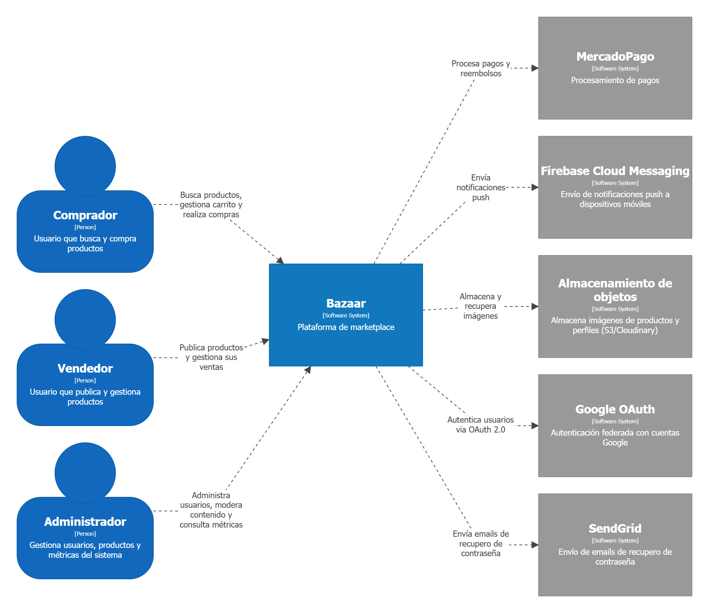
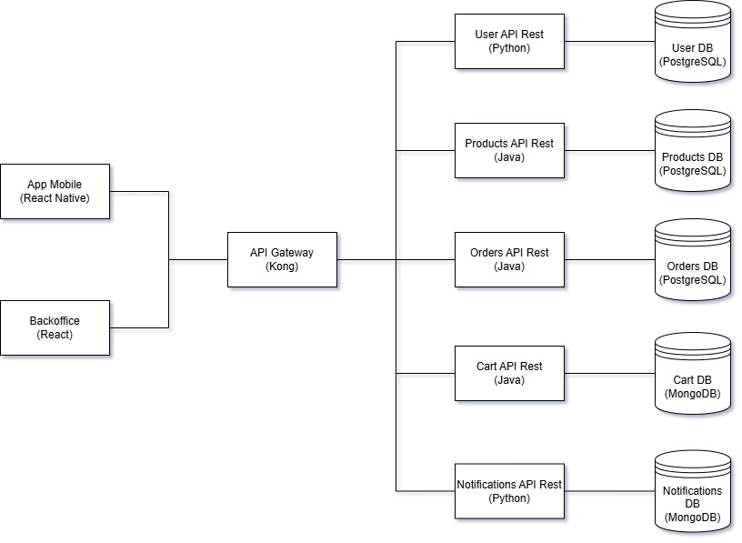
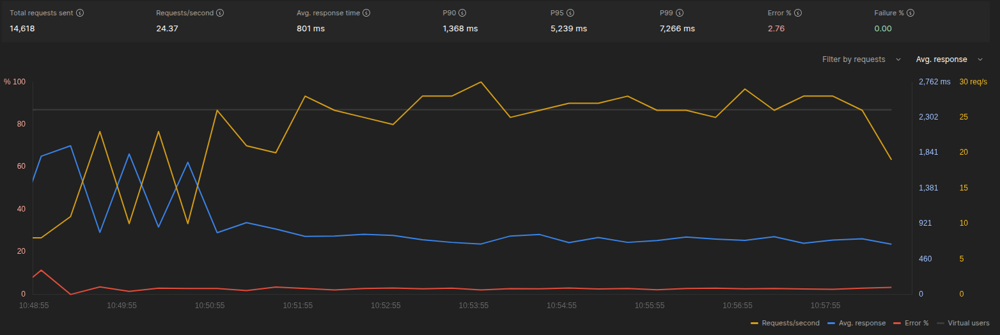
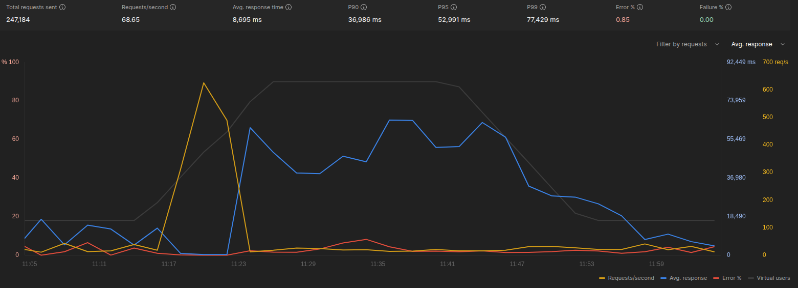
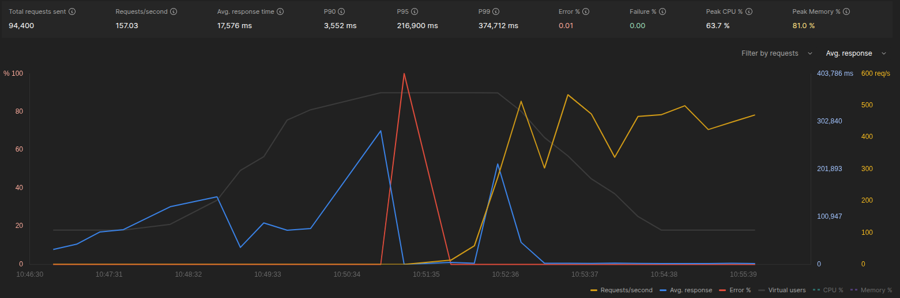

# Bazaar

## Integrantes

- Emanuel Tello 106157 etello@fi.uba.ar
- Federico Nicolás Pagnotta Lemes 110973 fpagnotta@fi.uba.ar
- Gaspar Notta 111389 Gnotta@fi.uba.ar
- Santiago Henseler 110732 shenseler@fi.uba.ar
- Rodrigo Martin Rotondo Andrada 109210 rrotondo@fi.uba.ar
- Melina Callebaut 105161 mcallebaut@fi.uba.ar

## Cobertura de los repositorios

#### Products [](https://codecov.io/gh/Bazaar-ids2/Products)

#### Orders [](https://codecov.io/github/bazaar-ids2/orders)

#### Cart [](https://codecov.io/gh/Bazaar-ids2/Cart)

#### User [](https://codecov.io/gh/Bazaar-ids2/User)

#### Notifications [](https://codecov.io/gh/Bazaar-ids2/Notifications)


## API Gateway

El sistema utiliza **Kong Gateway** como punto único de entrada para  los clientes externos (app mobile y backoffice). Centraliza el enrutamiento, la validación de JWT, el control de cuentas bloqueadas y el rate limiting. La decisión está documentada en [ADR-001](../adrs/adr_gateway.md).


## Diagrama de contexto




## Diseño de arquitectura



## Tecnologias elegidas

Para implementar el backend de los microservicios de Products, Orders y Cart se decidio utilizar Java. Se tomo esta decisión ya que java posee el framework [Spring Boot](https://spring.io/projects/spring-boot) el cual facilita y agiliza la creación de api-rest. Ademas es un lenguaje utilizado previamente por todos los miembros del equipo.
Debido a que se solicitaba el uso de un segundo lenguaje para los microservicios se tomo la decision de implementar el microservicio de User en Python, ya que con cuenta con el framework de [FastApi] (https://fastapi.tiangolo.com/) y es muy sencillo de utilizar. Por último, para el microservicio de Notifications, se optó por implementarlo con Node.js, utilizando el framework NestJS.

Se decidio que las bases de datos del sistema utilicen el sistema de gestión de bases de datos [PostgreSQL](https://www.postgresql.org/) dado que Spring Boot ofrece una integración nativa y sin necesidad de configuración del mismo. Como tambien se pedia la utilización de una base de datos no relacional se utilizo [MongoDB](https://www.mongodb.com/) para el microservicio Cart y Notifications.

Se eligio, por la recomendación de la catedra, el uso de [React Native](https://reactnative.dev/) para el frontend de la app mobile, y [React](https://es.react.dev/) para el backoffice del sistema.

Por último, en Notifications se utiliza RabbitMQ (proveedor CloudAMQP) y Redis (Upstash), para consumir notificaciones provenientes de Products y Orders, y evitar el envío de notificaciones duplicadas, respectivamente.

> **Nota:** El racional completo detrás de la elección de lenguajes, frameworks, bases de datos y herramientas de mensajería para el backend se encuentra documentado en detalle en el [ADR-02: Stack Tecnológico de Servicios Backend](../adrs/adr_tecnologias.md).

## Despliegue en la Nube
El sistema utiliza **Render** como plataforma (PaaS) para desplegar todos los microservicios y el API Gateway de manera automatizada junto a los pipelines de CI/CD. La decisión y estrategia están documentadas en el [ADR-03: Despliegue en la Nube con Render](../adrs/adr_03_deploy.md).

## Consistencia Distribuida
Para manejar de forma tolerante a fallos la comunicación entre servicios (checkout, reserva de stock y MercadoPago) previniendo inconsistencias como pagos exitosos con carritos vacíos o viceversa, se documentó un esquema específico disponible en el [ADR-04: Consistencia Distribuida en Checkout y Cancelación de Órdenes](../adrs/adr_04_consistencia.md).

## Racional de Diseño Front-end

La propuesta de Front-End para Bazaar se fundamenta en una **jerarquía visual rigurosa** que prioriza la confianza del usuario mediante una paleta orgánica de tonos terracota y crema. Se ha implementado una gramática de componentes donde las acciones primarias (Pagar, Publicar, Confirmar) utilizan botones de color sólido para maximizar el _affordance_, mientras que las acciones de exploración (Ver detalle) se relegan a enlaces de texto. Esta diferenciación sistemática reduce la carga cognitiva al estandarizar el comportamiento del usuario: el color siempre indica avance transaccional, mientras que el texto plano invita a la navegación secundaria, manteniendo una estética sofisticada que refuerza la identidad artesanal de la plataforma.

La **arquitectura de navegación** adopta un modelo híbrido que integra un _Tab Bar_ inferior para las secciones troncales y un acceso de identidad global en la cabecera. Esta estructura permite que los roles de comprador y vendedor coexistan sin generar fricción, asegurando que el usuario mantenga siempre el sentido de ubicación mediante indicadores de estado activo. Asimismo, se priorizó la **robustez operativa** a través de una gestión de errores proactiva; los formularios incorporan validaciones en tiempo real y estados deshabilitados para los botones de envío. Estas decisiones técnicas no solo optimizan el rendimiento al evitar peticiones inválidas al servidor, sino que consolidan la "confianza extrema" de Bazaar al garantizar que cada interacción sea clara, segura y libre de ambigüedades.

# Products

- Se tomo la decisión de que las categorias de los productos se puedan agregar dinamicamente por parte del administrador a través del endpoint `/category`, para que sea más sencillo agregar nuevas categorias.
- La API rest se va a implementar en `JAVA` con el framework de springBoot y utilizando como servicio de base de datos `Postgress`
- Se determino que las imagenes van a ser cargadas mediante `MultipartFile` (herramienta proporcionada por springBoot) a través del endpoint `/products/images` y luego almacenadas en bucket de  [SupaBase](https://supabase.com/) (Recomendación de la catedra). Dentro de la base de datos de products NO se va a almacenar la imagen, se guarda dentro de cada product una lista con las url de donde estan alojadas.
- Se integro el sistema de monitore [Prometheus](https://docs.spring.io/spring-boot/api/rest/actuator/prometheus.html), a traves del endpoint `/actuator/prometheus`
- Para el manejo del stock al momento de hacer el checkout se decidio utilizar un campo, llamado checkoutStock, que indica que parte del stock se reservo para los checkouts que estan activos. Si se completa el checkout y se paga el producto, se descuenta del stock y del checkoutStock. En cambio si se cancela la compra solo se descuenta del checkoutStock. 

## Pre requisitos

Para poder utilizar el proyecto es necesario tener instalado lo siguiente:
- [OpenJDK](https://www.oracle.com/java/technologies/javase/jdk21-archive-downloads.html) >= a 21.0.2
- [Docker Compose](https://docs.docker.com/compose/install/) >= v2.29.7
- [Docker](https://www.docker.com/get-started/) >= 24.0.7

## Comandos

- Comando para construir el servicio:
    `docker compose up --build`

- Comando para testing:
  una vez construido el servicio ejecutar `docker exec -it products_backend_1 mvn test`

## Tests

#### Covertura: [](https://codecov.io/gh/Bazaar-ids2/Products)

#### Carga: Para los test de carga utilizamos una funcionalidad de postman 

- En el primer intento se utilizaron 10 usuario concurrentes sin ningun pico de carga y el sistema respondio sin ningun error
<div align="center">
    
</div> 

- En el segundo intento se utilizaron 1000 usuarios concurrentes con un pico de carga largo en el tiempo. El sistema respondio bien, pero en mitad del pico de carga tuvo unos pocos errores
<div align="center">
    
</div> 

- En el ultimo intento se utilizaron 10000 usuarios concurrentes con un pico de carga igual que el caso anterior. En medio del pico de carga el sistema colapso por un pequeño momento y luego se pudo recuperar.
<div align="center">
    
</div> 

# Cart

- La API rest se va a implementar en `JAVA` con el framework de springBoot y utilizando como servicio de base de datos `MongoDB`
- Se tomo la desición de utilizar `MongoDB` como base de datos ya que su diseño orientado a objetos facilita las consultas al carrito.

## Pre requisitos

Para poder utilizar el proyecto es necesario tener instalado lo siguiente:
- [OpenJDK](https://www.oracle.com/java/technologies/javase/jdk21-archive-downloads.html) >= a 21.0.2
- [Docker Compose](https://docs.docker.com/compose/install/) >= v2.29.7
- [Docker](https://www.docker.com/get-started/) >= 24.0.7

## Comandos

- Comando para construir el servicio:
    `docker compose up --build`

- Comando para testing:
  una vez construido el servicio ejecutar `docker exec -it cart_backend_1 mvn test`

## Tests

#### Covertura: [](https://codecov.io/gh/Bazaar-ids2/Cart)

#### Carga: Para los test de carga utilizamos una funcionalidad de postman 

# Users API

Microservicio de gestión de usuarios para la plataforma Bazaar. Construido con FastAPI + PostgreSQL.

---

## Tabla de contenidos

- [Stack](#stack)
- [Estructura del proyecto](#estructura-del-proyecto)
- [Instalación y puesta en marcha](#instalación-y-puesta-en-marcha)
- [Variables de entorno](#variables-de-entorno)
- [Endpoints](#endpoints)
- [Autenticación](#autenticación)
- [Modelos de base de datos](#modelos-de-base-de-datos)
- [Schemas Pydantic](#schemas-pydantic)
- [Flujos principales](#flujos-principales)
- [Validaciones](#validaciones)
- [Integración con servicios externos](#integración-con-servicios-externos)
- [Tests](#tests)

---

## Stack

| Tecnología | Uso |
|---|---|
| FastAPI 0.135 | Framework web |
| PostgreSQL 17 | Base de datos |
| SQLAlchemy 2.0 | ORM |
| Pydantic v2 | Validación de datos |
| PyJWT | Generación de tokens JWT |
| pwdlib (Argon2) | Hash de contraseñas |
| Cloudinary | Almacenamiento de imágenes |
| SendGrid | Envío de emails |
| httpx | Cliente HTTP (Google OAuth) |
| pytest | Testing |

---

## Estructura del proyecto

```
.
├── app/
│   ├── main.py                          # Punto de entrada
│   ├── config.py                        # Variables de configuración
│   ├── database.py                      # Configuración SQLAlchemy
│   ├── dependencies.py                  # Dependencias de autenticación
│   ├── models/
│   │   ├── user.py
│   │   ├── refresh_token.py
│   │   └── password_reset_token.py
│   ├── repositories/
│   │   ├── user_repository.py
│   │   ├── refresh_token_repository.py
│   │   └── password_reset_repository.py
│   ├── routers/
│   │   ├── auth_router.py
│   │   ├── user_router.py
│   │   └── admin_router.py
│   ├── schemas/
│   │   ├── auth.py
│   │   ├── user.py
│   │   └── password_reset.py
│   └── services/
│       ├── auth_service.py
│       ├── google_auth_service.py
│       ├── user_service.py
│       ├── password_reset_service.py
│       ├── image_service.py
│       └── products_service.py
├── test/
│   ├── conftest.py
│   ├── admin_test.py
│   ├── create_users_test.py
│   ├── google_auth_test.py
│   ├── login_test.py
│   ├── password_reset_test.py
│   ├── profile_test.py
│   └── refresh_token_test.py
├── docker-compose.yml
├── requirements.txt
└── example_env.txt
```

---

## Instalación y puesta en marcha

### 1. Entorno virtual

```bash
python3 -m venv venv
source venv/bin/activate
pip install -r requirements.txt
```

### 2. Variables de entorno

```bash
cp example_env.txt .env
# Editar .env con los valores reales
```

### 3. Base de datos

```bash
docker compose up -d
```

### 4. Levantar la API

```bash
uvicorn app.main:app --reload
```

La API queda disponible en `http://localhost:8000`.
Swagger UI en `http://localhost:8000/docs`.

---

## Variables de entorno

| Variable | Default | Descripción |
|---|---|---|
| `DATABASE_URL` | — | URL de conexión PostgreSQL |
| `TEST_DATABASE_URL` | — | URL de BD para tests |
| `SECRET_KEY` | — | Clave secreta para firmar JWT |
| `ALGORITHM` | `HS256` | Algoritmo JWT |
| `ACCESS_TOKEN_EXPIRE_MINUTES` | `60` | Expiración del access token |
| `REFRESH_TOKEN_EXPIRE_DAYS` | `7` | Expiración del refresh token |
| `RESET_TOKEN_EXPIRATION_MINUTES` | `60` | Expiración del token de reset |
| `RESET_PASSWORD_URL` | — | Deep link de la app para reset |
| `RESET_MAX_ATTEMPTS` | `3` | Máx solicitudes de reset por ventana |
| `RESET_WINDOW_MINUTES` | `15` | Ventana de tiempo para rate limiting |
| `SENDGRID_API_KEY` | — | API key de SendGrid |
| `SENDGRID_FROM_EMAIL` | — | Email remitente verificado |
| `CLOUDINARY_CLOUD_NAME` | — | Cloud name de Cloudinary |
| `CLOUDINARY_API_KEY` | — | API key de Cloudinary |
| `CLOUDINARY_API_SECRET` | — | API secret de Cloudinary |
| `MAX_PROFILE_PICTURE_SIZE` | `5242880` | Tamaño máximo de imagen en bytes (5 MB) |
| `GOOGLE_CLIENT_ID` | — | Client ID de Google OAuth |
| `GOOGLE_CLIENT_SECRET` | — | Client secret de Google OAuth |
| `GOOGLE_REDIRECT_URI` | `http://localhost:8000/auth/google/callback` | URI de callback de Google |
| `PRODUCTS_API_URL` | — | URL base del servicio de productos |
| `API_BASE_URL` | — | URL base de este servicio |

---

## Endpoints

### Auth (`/auth`)

| Método | Path | Auth | Descripción |
|---|---|---|---|
| POST | `/auth/login` | No | Login con email y contraseña |
| POST | `/auth/refresh` | No | Obtener nuevo access token con refresh token |
| GET | `/auth/google` | No | Obtener URL de autenticación Google |
| GET | `/auth/google/callback` | No | Callback de Google OAuth2 |
| GET | `/auth/reset-password/redirect` | No | Redirect HTML al deep link de reset |
| POST | `/auth/forgot-password` | No | Solicitar email de reset de contraseña |
| POST | `/auth/reset-password` | No | Confirmar reset con nuevo password |

### Usuarios (`/users`)

| Método | Path | Auth | Descripción |
|---|---|---|---|
| POST | `/users` | No | Registrar nuevo usuario |
| GET | `/users/me` | Sí | Ver perfil propio |
| PATCH | `/users/me` | Sí | Editar nombre y descripción |
| PATCH | `/users/me/profile-picture` | Sí | Subir foto de perfil |
| GET | `/users/{user_id}` | No | Obtener datos de usuario por ID |
| GET | `/users/{user_id}/profile` | No | Ver perfil público de otro usuario |

### Admin (`/admin`)

Todos los endpoints requieren usuario administrador (`X-User-Id` con `is_admin=true`).

| Método | Path | Descripción |
|---|---|---|
| GET | `/admin/users` | Listar todos los usuarios |
| PATCH | `/admin/users/{user_id}/promote` | Promover a administrador |
| PATCH | `/admin/users/{user_id}/demote` | Quitar rol de administrador |
| PATCH | `/admin/users/{user_id}/block` | Bloquear usuario |
| PATCH | `/admin/users/{user_id}/unblock` | Desbloquear usuario |

---

## Autenticación

Los endpoints protegidos requieren el header `X-User-Id` con el ID numérico del usuario:

```
X-User-Id: 42
```

El JWT generado en login/refresh es para uso entre servicios. La validación de identidad dentro de este servicio se hace por el header `X-User-Id`.

---

## Modelos de base de datos

### `users`

| Campo | Tipo | Restricciones |
|---|---|---|
| `id` | Integer | PK |
| `name` | String | NOT NULL |
| `email` | String | UNIQUE, NOT NULL, indexed |
| `hashed_password` | String | nullable (usuarios Google no tienen) |
| `google_id` | String | UNIQUE, nullable, indexed |
| `is_admin` | Boolean | default=False |
| `is_blocked` | Boolean | default=False |
| `description` | String(500) | nullable |
| `profile_picture_url` | String | nullable |

### `refresh_tokens`

| Campo | Tipo | Restricciones |
|---|---|---|
| `id` | Integer | PK |
| `user_id` | Integer | FK → users.id |
| `token_hash` | String | UNIQUE, indexed |
| `expires_at` | DateTime (tz) | NOT NULL |
| `revoked_at` | DateTime (tz) | nullable |
| `created_at` | DateTime (tz) | default=now |

### `password_reset_tokens`

| Campo | Tipo | Restricciones |
|---|---|---|
| `id` | Integer | PK |
| `user_id` | Integer | FK → users.id |
| `token_hash` | String | UNIQUE, indexed |
| `expires_at` | DateTime (tz) | NOT NULL |
| `used_at` | DateTime (tz) | nullable |
| `created_at` | DateTime (tz) | default=now |

---

## Schemas Pydantic

### Request

```python
# Registro
UserCreate:
    name: str          # min 4, max 100
    email: EmailStr
    password: str      # min 8, max 128 + validaciones

# Edición de perfil
UserUpdate:
    name: str | None   # min 4, max 100
    description: str | None  # max 500

# Login
LoginRequest:
    email: EmailStr
    password: str

# Refresh
RefreshRequest:
    refresh_token: str

# Reset de contraseña
ForgotPasswordRequest:
    email: EmailStr

ResetPasswordRequest:
    token: str
    new_password: str
    confirm_password: str
```

### Response

```python
# Login / Refresh
TokenResponse:
    access_token: str
    refresh_token: str
    token_type: str = "bearer"

# Perfil propio
OwnProfileResponse:
    id, name, email, description, profile_picture_url, is_admin, is_blocked

# Perfil público (sin datos sensibles)
PublicUserResponse:
    id, name, description, profile_picture_url

# Datos de usuario (admin)
UserResponse:
    id, name, email, is_admin, is_blocked
```

---

## Flujos principales

### Login

1. Recibe `email` + `password`
2. Valida credenciales y que el usuario no esté bloqueado
3. Genera `access_token` (JWT, expira en `ACCESS_TOKEN_EXPIRE_MINUTES`)
4. Genera `refresh_token` (token aleatorio de 256 bits, hasheado con SHA-256 y guardado en BD)
5. Limpia refresh tokens expirados del usuario antes de guardar el nuevo
6. Devuelve ambos tokens

### Refresh de sesión

1. Recibe `refresh_token`
2. Busca el hash en la tabla `refresh_tokens`
3. Valida que no esté revocado ni expirado y que el usuario no esté bloqueado
4. Devuelve nuevo `access_token`

### Google OAuth

1. `GET /auth/google` → devuelve URL de consentimiento de Google
2. Usuario autoriza → Google redirige a `/auth/google/callback?code=...`
3. Se intercambia el code por un access token de Google
4. Se obtiene info del usuario (email, nombre, google_id)
5. Si el usuario no existe, se crea; si existe por email, se vincula el google_id
6. Se redirige a `bazaar://auth?token={access_token}`

### Reset de contraseña

1. `POST /auth/forgot-password` → genera token (256 bits), lo hashea, lo guarda en BD y envía email via SendGrid. Rate limit: 3 solicitudes cada 15 minutos.
2. El usuario abre el link del email → `GET /auth/reset-password/redirect?token=...` → redirige al deep link de la app
3. La app llama a `POST /auth/reset-password` con el token y el nuevo password
4. Se valida el token (existe, no usado, no expirado) y se actualiza la contraseña

### Subida de foto de perfil

1. Recibe archivo via `multipart/form-data`
2. Valida tamaño (máx `MAX_PROFILE_PICTURE_SIZE`, default 5 MB)
3. Valida tipo real del archivo por **magic bytes** (no por content-type):
   - JPEG: `\xFF\xD8\xFF`
   - PNG: `\x89PNG\r\n\x1a\n`
   - WebP: `RIFF....WEBP`
4. Sube a Cloudinary en `users/profile_pictures/user_{id}`
5. Guarda la URL resultante en `profile_picture_url`

### Bloqueo/desbloqueo de usuario (Admin)

1. Valida que el admin no se bloquee a sí mismo
2. Llama al servicio de productos: `PATCH {PRODUCTS_API_URL}/products/blockSeller/{user_id}`
3. Actualiza `is_blocked` en la BD
4. Si el servicio de productos falla, devuelve 502

---

## Validaciones

### Contraseñas

Aplica tanto al registro como al reset de contraseña:

- Mínimo 8 caracteres, máximo 128
- Al menos 1 mayúscula
- Al menos 1 minúscula
- Al menos 1 número
- Al menos 1 carácter especial: `@$!%*?&._-#`

### Descripción de perfil

- Máximo 500 caracteres
- Validado tanto en el schema (Pydantic) como en la columna de BD (`String(500)`)

### Hashing

- **Contraseñas:** Argon2 via `pwdlib`
- **Tokens (refresh, reset):** SHA-256

---

## Integración con servicios externos

### SendGrid

Usado para enviar emails de recuperación de contraseña. Requiere `SENDGRID_API_KEY` y `SENDGRID_FROM_EMAIL` (email verificado en SendGrid).

### Cloudinary

Almacenamiento de fotos de perfil. Las imágenes se guardan en la carpeta `users/profile_pictures/` con `public_id=user_{id}` (se sobreescribe al subir una nueva foto).

### Google OAuth 2.0

Autenticación federada. Requiere credenciales de una aplicación OAuth configurada en Google Cloud Console con el redirect URI correcto.

### Products Service

Servicio interno. Se le notifica cuando un usuario es bloqueado o desbloqueado para que gestione sus publicaciones. Comunicación via `PATCH` con header `X-User-Admin: true`.

---

## Tests

```bash
# Correr todos los tests
pytest

# Con reporte de cobertura
pytest --cov=app --cov-report=term-missing
```

La BD de tests (`usersdb_test`) debe existir antes de correr los tests:

```bash
PGPASSWORD=postgres psql -h localhost -U postgres -d postgres -c "CREATE DATABASE usersdb_test;"
```

Cobertura actual:  [](https://codecov.io/gh/Bazaar-ids2/User)


